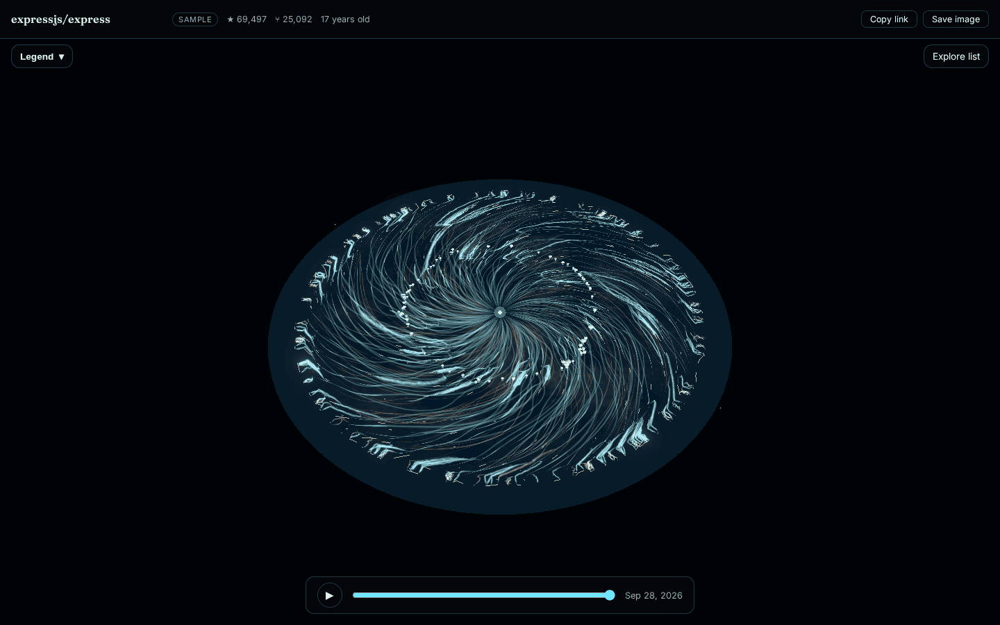

# Huerto

Every repository grows a mycelium galaxy. Enter a GitHub `owner/repo` and watch
its history unfold as a bioluminescent colony of hyphae, spiraling outward
from a central spore — the same repository always grows the same shape,
seeded deterministically from its name.



## Mapping

Every visible element maps to real data (nothing is decorative filler):

| Element                        | Real data                                                   |
| ------------------------------- | ------------------------------------------------------------ |
| Spore (center)                  | The repository's first commit                                |
| Distance from center            | Time — how far back in the repository's history              |
| Filament (hypha)                | A pull request; its length reflects the amount of real work (commits/changes) |
| Fork (a filament splitting off) | A branch created                                              |
| Knot (a filament fusing back in)| A pull request merged                                         |
| Dry, brown filament              | A pull request closed without merging                         |
| Glowing tip                     | An open pull request or a live branch, still growing          |
| Fine hair                       | An individual commit                                          |
| Mushroom                        | A release — cream cap with a cyan rim, sized by version bump  |

Angle carries no data — it's purely how the colony fills the disc (see
"How it works" below).

## Try it

- Enter any `owner/repo` on the landing page, or paste a full GitHub URL.
- The bundled sample repository (`pmndrs/valtio`) always works, even with no
  `GITHUB_TOKEN` configured (see [GitHub API](#github-api) below).
- `?sel=<id>` in a viewer URL deep-links to a selected element -- "Copy
  link" in the viewer header copies a shareable URL that includes it.

## How it works

The colony grows by real work, not by decoration:

- **Work-driven length**: a pull request's hypha grows longer the more real
  work it represents (commits and changed lines), not just its time span.
- **Gap-filling forks**: new growth (space colonization) reaches toward the
  colony's own least-covered gaps, so the disc fills evenly instead of
  clumping or leaving bare patches -- the same principle real fungal mycelium
  and plant root systems use to forage efficiently.
- **Galaxy swirl**: an extra rotation is applied outward from the spore,
  bending the colony's radial growth into spiral-galaxy arms. This swirl (and
  a filament's exact angle in general) carries **no data** -- only radius
  (time) and length (work) are real; angle is purely a visual device so the
  colony reads as one coherent galaxy instead of an evenly-spaced starburst.
- Selecting an element highlights its whole hypha and dims the rest; a
  release's mushroom reveals a faint growth-ring hairline at its own radius.

## Stack

Vite, React, TypeScript (strict), React Three Fiber + drei, [wouter](https://github.com/molefrog/wouter)
(routing), Vitest, ESLint (flat config).

## Architecture

Hexagonal: `src/domain` is pure (no React, no three.js, no fetch); adapters
and the UI depend on it, never the other way around.

```
src/domain/       pure domain logic (no React, no three.js, no fetch)
  network/        the mycelium colony model: topology, layout, mushrooms,
                   growth rings, element lookup/detail, explore-list grouping
  shared/         metaphor-agnostic primitives: vectors, seeded PRNG, time
                   bounds, playback easing
  repo.ts         the repository snapshot shape fetched from GitHub
  elementDetail.ts, format.ts, parseRepoInput.ts, ...  shared view-model /
                   formatting / parsing helpers
src/adapters/     outbound adapters, e.g. the GitHub GraphQL client
src/server/       the repo-snapshot request handler shared by dev and prod,
                   plus the bundled offline fixtures
src/ui/           React / React Three Fiber presentation layer
  pages/          route-level components (landing, viewer, 404)
  components/     shared UI (detail panel, header, legend, explore list, ...)
  scene/network/  the lazy-loaded 3D chunk: the colony's geometry, shaders,
                   camera, picking and growth animation
api/              Vercel serverless function entry points
scripts/          fixture generation, visual QA screenshots, hero images
```

## Getting started

```bash
pnpm install
cp .env.example .env   # add a GITHUB_TOKEN to raise the API rate limit
pnpm dev
```

## Scripts

| Script              | Purpose                                                |
| -------------------- | -------------------------------------------------------- |
| `pnpm dev`           | Start the Vite dev server                              |
| `pnpm build`         | Typecheck and build for production                     |
| `pnpm preview`       | Preview the production build                            |
| `pnpm typecheck`     | Run the TypeScript compiler (no emit)                   |
| `pnpm lint`          | Run ESLint                                               |
| `pnpm test`          | Run the Vitest suite                                     |
| `pnpm shot`          | Headless visual QA screenshots (`.shots/`, gitignored)   |
| `pnpm network-svg`   | Dev-only flat-SVG debug render of the colony layout      |
| `pnpm hero-images`   | Regenerate `public/og.png`, `public/hero.png`, `docs/screenshot.png` from a real render |
| `pnpm fixture`       | Regenerate a bundled offline fixture (needs `GITHUB_TOKEN`) |

## GitHub API

Without a `GITHUB_TOKEN`, GitHub limits unauthenticated requests to 60/hour,
and only the bundled sample repository renders (any other repo shows a
"token required" state explaining this). Set `GITHUB_TOKEN` (copy
`.env.example` to `.env`) to a personal access token with no special scopes
for public repositories to browse any public GitHub repository. Real
credentials are never committed; only `.env.example` is tracked.

## Deploy on Vercel

This is a standard Vite app with a Vercel serverless function
(`api/repo.ts`) for the same repo-snapshot handler the dev server uses.

1. Import the repository into Vercel (framework preset: Vite).
2. Set the `GITHUB_TOKEN` environment variable in the Vercel project
   settings (optional -- without it, only the bundled sample repo works).
3. Deploy. `vercel.json` rewrites unmatched paths to `index.html` so
   client-side routes (`/owner/repo`) resolve correctly on a hard
   refresh/deep link.

## Credits

Built by [TanisJam](https://github.com/TanisJam) · [mnr.ar](https://mnr.ar)
